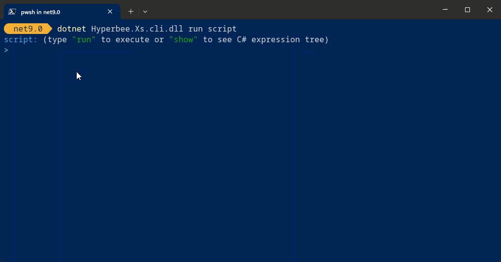

# XS.Cli: Cli tooling for Hyperbee.XS

### **What is XS?**

[XS](https://github.com/Stillpoint-Software/hyperbee.xs) is a lightweight scripting language designed to simplify and enhance the use of C# expression trees.
It provides a familiar C#-like syntax while offering advanced extensibility, making it a compelling choice for developers
building domain-specific languages (DSLs), rules engines, or dynamic runtime logic systems.

XS.Cli added dotnet commands like:

- run
- compile
- repl

## Examples




### Install Xs.Cli using 

you can install Xs.Cli using the following command:
```
dotnet tool install -g hyperbee.xs.cli
```
or following Microsoft's [documentation](https://docs.microsoft.com/en-us/dotnet/core/tools/dotnet-tool-install)

### Run
```
dotnet xs run script
```
or:
```
dotnet xs run file ./script.xs
```

### Compile
```
xs compile -s "1 + 1" -o "output.dll"
```

### Repl
```
xs repl
```

## Contributing

We welcome contributions! Please see our [Contributing Guide](https://github.com/Stillpoint-Software/.github/blob/main/.github/CONTRIBUTING.md) 
for more details.
